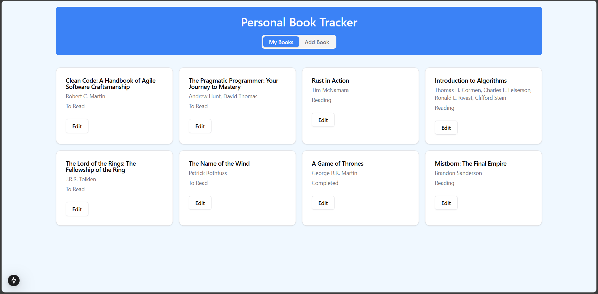
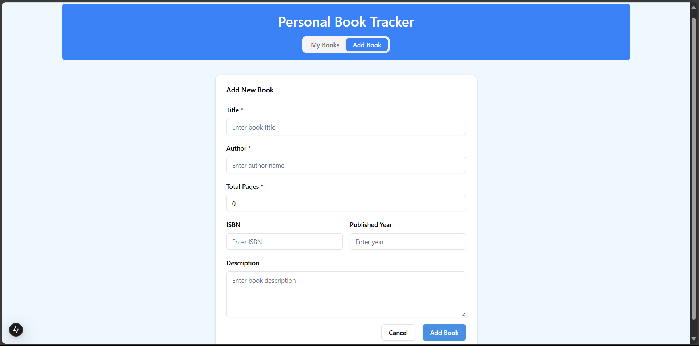
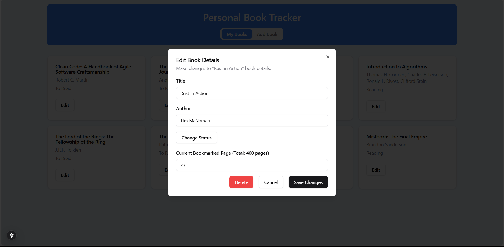

# Personal Book Tracker

A web app to track books you are currently reading, have read, or want to read. Personal Book Tracker is a simple, easy to use web app to keep track of your personal book library. Add new books, edit and update book details as needed, and view your books in a responsive UI.
Created using NextJS, Tailwind CSS, Shadcn/ui and Axios to practice NextJS, React, Tailwind and Axios. UI and Backend postgres calls are made using NextJS.

## Contents

- [Personal Book Tracker](#personal-book-tracker)
  - [Contents](#contents)
  - [Features](#features)
  - [Installation](#installation)
  - [Setup PostgreSQL Database](#setup-postgresql-database)
    - [Step 1: Create a Database](#step-1-create-a-database)
    - [Step 2: Create the `book` Table](#step-2-create-the-book-table)
  - [Technologies Used](#technologies-used)
  - [Screenshots](#screenshots)
    - [Book Cards in Homepage](#book-cards-in-homepage)
    - [Add Book Form](#add-book-form)
    - [Edit Book Form](#edit-book-form)

## Features

-   Add new books to your personal library with details like title, author, description, ISBN, published year, and more.
-   Categorize books by status: Reading, Completed, or To Read.
-   Edit and update book details as needed like when you start reading, finish reading and change bookmarked page.
-   Delete books from your library.
-   Responsive UI with a clean and modern design.
-   Utilize a dropdown radio menu to change the status of books conveniently.

## Installation

1. Clone the repository:

    ```bash
    git clone https://github.com/rasikww/personal-book-tracker.git
    cd personal-book-tracker
    ```

2. Install the dependencies:

    ```bash
    npm install
    ```

3. Set up environment variables. Change the `.env.template` to a `.env` file in the root directory and add your PostgreSQL database connection details.

4. Run the development server:

    ```bash
    npm run dev
    ```

5. Open [http://localhost:3000](http://localhost:3000) with your browser to see the application.

## Setup PostgreSQL Database

### Step 1: Create a Database

Create a new PostgreSQL database named `books_db` by running the following

```sql
CREATE DATABASE books_db;
```

### Step 2: Create the `book` Table

Create a new table named book in the books_db database with the following structure:

```sql
CREATE TABLE book (
    id SERIAL PRIMARY KEY,
    title TEXT NOT NULL,
    author TEXT NOT NULL,
    description TEXT,
    isbn TEXT,
    published_year INTEGER,
    total_pages INTEGER DEFAULT 0,
    bookmarked_page INTEGER DEFAULT 0,
    status TEXT DEFAULT 'To Read'
);
```

## Technologies Used

-   **Next.js**: A React framework for building fast, modern web applications.
-   **Tailwind CSS**: A utility-first CSS framework for styling.
-   **Axios**: A promise-based HTTP client for the browser and Node.js.
-   **Shadcn/ui**: A set of UI components for building accessible and customizable interfaces.
-   **PostgreSQL**: A powerful, open-source relational database system.

## Screenshots

### Book Cards in Homepage



### Add Book Form



### Edit Book Form


